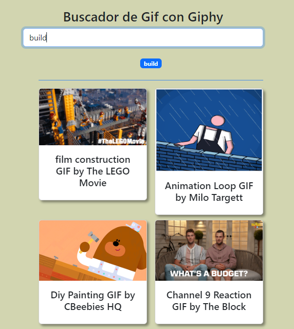
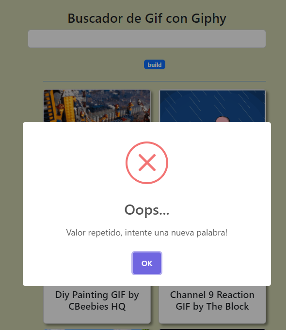

# Buscador de Gifs con Giphy

Aplicación clásica al iniciar en el aprendizaje de React, un buscador de gifs consumiendo la API de giphy, donde mostraremos los resultados de forma ordenada con ayuda de alguna libreria de maquetación, se utilizarón las siguientes tecnologias:

- HTML
- CSS
- JavaScript
- React
- Sweetalert
- Bootstrap

## Capturas de la aplicación

>Inicio de la App

>Cuando se busca un valor repetido
